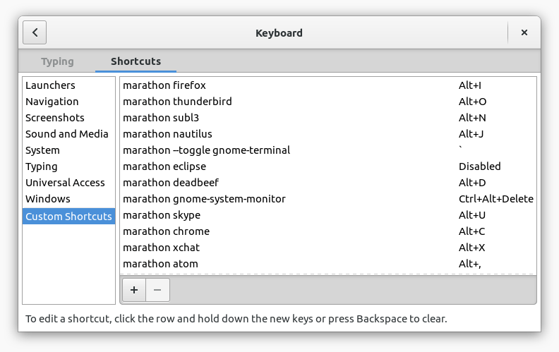

marathon
========

**marathon** is a minimal shell-based launcher for Linux/X that tries to be
smart about running or focusing apps. When calling `marathon application`,

* If `application` is not running, marathon will **run** it.
* Else marathon will just **focus** `application`

That way, after binding your favorite apps to a few easily-accessible OS
global keyboard shortcuts, you can access them with a single keypress and
**forget about alt-tabbing or clicking on stuff in your dock / window list**.

Flags:

* `--toggle` will emulate the Quake terminal-like behavior of *minimizing*
  already-focused windows. (By default, marathon leave them untouched.)

* `--ignore-args-on-focus` will *ignore command arguments when focusing*
   (e.g. `--incognito` in `marathon google-chrome --incognito`) while still
   passing them on initial run.
   - This is useful for applications who use a runner or spawn other processes,
     making ineffective post-exec searching for the fully-qualified command.
   - This is not what you want if the process you want to focus needs arguments
     to be uniquely identified (e.g. `gvim -S work`).

Installation
------------

- **Mac OSX is not supported**, sorry (due to depending on X11 utilities).
  But rejoice, you'll be well served with Automator or Alfred, see for example
  [this guide](http://superuser.com/questions/245711/starting-application-with-custom-keyboard-shortcut)

- **Linux**:
    1. X is required, as there is currently no equivalent to `wmctrl` and `xdotool` under Wayland.
       You'll have to [disable Wayland](https://wiki.archlinux.org/index.php/GDM#Use_Xorg_backend).
       Suggestions welcome on issue [#5 - Support Wayland](https://github.com/ronjouch/marathon/issues/5).
    2. **Install `wmctrl` and `xdotool`** from your package manager.
    3. Drop `marathon` somewhere in your `$PATH`.
    4. Bind `marathon command` (optionally adding flags) to a keyboard shortcut:
        * GNOME → Settings → *Keyboard* section → *Shortcut* tab → *Custom Shortcuts*.
          Mine look like:  
          
        * LXDE → your `lxde-rc.xml`

Support, license, contact
-------------------------

[Bug Reports](https://github.com/ronjouch/marathon/issues) and
[Pull Requests](https://github.com/ronjouch/marathon/pulls) are welcome.

Licensed under the MIT license, 2012-2016,
[Ronan Jouchet](mailto:firstname@lastname.fr) / [@ronjouch](https://twitter.com/ronjouch)
