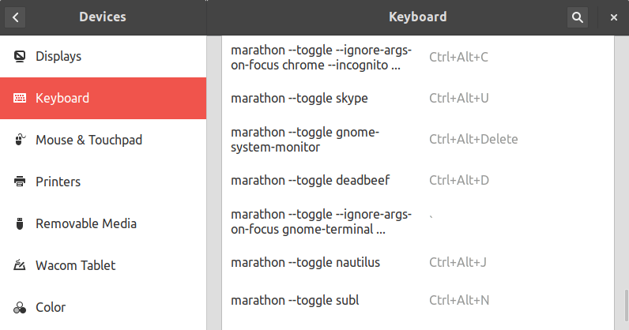

marathon
========

**marathon** is a minimal shell-based launcher for Linux that tries to be smart about running or focusing apps. When calling `marathon foo`,

* If `foo` is not running, marathon will **run** it.
* Else marathon will just **focus** `foo`

That way, after binding your favorite apps to a few easily-accessible keyboard shortcuts, you can access them with a single keypress and **forget about alt-tabbing or clicking on stuff in your dock / selector**.

By default, marathon will have no effect on already-focused windows, but a `--toggle` flag is supported to emulate the Quake-like behavior of instead *minimizing* the focused window.

Installation
------------

- **Mac OSX is not supported, sorry**. But rejoice, you'll be well served with Automator or Alfred, see [this guide](http://superuser.com/questions/245711/starting-application-with-custom-keyboard-shortcut) for example.  

- **Linux**:
    1. **Install `wmctrl` and `xdotool`** from your package manager.
    2. Drop `marathon` somewhere in your `$PATH`.
    3. Bind `marathon command` to some keyboard shortcut:
        * GNOME → Settings → *Keyboard* section → *Shortcut* tab → *Custom Shortcuts*. Mine look like:  
        
        * LXDE → your `lxde-rc.xml`

Support, license, contact
-------------------------

[Bug Reports](https://github.com/ronjouch/marathon/issues) and [Pull Requests](https://github.com/ronjouch/marathon/pulls) are welcome via GitHub.

Licensed under the MIT license, 2012-2015, [ronan@jouchet.fr](mailto:ronan@jouchet.fr) / [@ronjouch](https://twitter.com/ronjouch)
